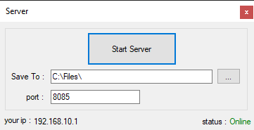

# Easy File Transfer
An easy way to transfer file with **any size** on network with tcp protocol.

##usage

1. install nuget package:
```nuget
	Install-Package EasyFileTransfer -Version 0.1.5
```

2. import the EasyFileTransfer library:
```csharp
	using EasyFileTransfer;
```

3. for server at first you should start the EftServer:
```csharp
	EftServer server = new EftServer(saveTo, port);
    System.Threading.Thread thread = new System.Threading.Thread(server.StartServer);
    thread.Start();
```

4. for client you can send file with this line:
```csharp
	EftClient.Send(Path/to/file, serverIP, serverPort);
```

it's finished. you can enjoy that.
don't forget star this repository. :)

## Screenshots
sample screenshots like this:

| Server  | Client |
| ------------- | ------------- |
|   |   |


