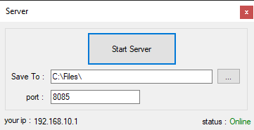
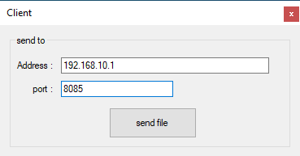

# Easy File Transfer

[](https://github.com/Jamalianpour/EasyFileTransfer/actions/workflows/ci.yml)
[](https://www.nuget.org/packages/EasyFileTransfer)

An easy way to transfer files of **any size** over a network using TCP.

- Streams files of any size with constant memory use
- Async API with progress reporting and cancellation
- SHA-256 integrity check on every transfer
- Optional access-token authentication and TLS encryption
- Hardened server: file-name validation, size limits, connection limits and timeouts
- Targets .NET Standard 2.0, .NET 8 and .NET 10

## Install

```shell
dotnet add package EasyFileTransfer --prerelease
```

## Usage

### Server

```csharp
using EasyFileTransfer;

var server = new EftServer(new EftServerOptions
{
    SaveDirectory = @"C:\Inbox",
    Port = 1300,
    AccessToken = "a-long-random-secret",   // recommended
});

server.FileReceived += (s, e) => Console.WriteLine($"Saved {e.FilePath} ({e.Length} bytes) from {e.RemoteEndPoint}");
server.TransferFailed += (s, e) => Console.WriteLine($"Rejected {e.RemoteEndPoint}: {e.Exception.Message}");

server.Start();          // returns immediately; the server runs in the background
// ...
await server.StopAsync();
```

### Client

```csharp
using EasyFileTransfer;

var client = new EftClient("192.168.1.10", 1300, new EftClientOptions
{
    AccessToken = "a-long-random-secret",
});

var progress = new Progress<EftProgress>(p => Console.WriteLine($"{p.Percentage:0}%"));
await client.SendFileAsync(@"C:\big.iso", progress, cancellationToken);
```

`SendFileAsync` throws `EftException` (with a `Status` such as `AuthenticationFailed`, `FileTooLarge` or
`IntegrityCheckFailed`) when the server rejects a transfer, `TimeoutException` when the network stalls,
and `IOException` for other network errors. `SendAsync(stream, fileName)` sends any seekable stream.

### Encrypting with TLS

Give the server a certificate with a private key and turn on `UseTls` in the client:

```csharp
var server = new EftServer(new EftServerOptions
{
    SaveDirectory = @"C:\Inbox",
    AccessToken = token,
    ServerCertificate = X509CertificateLoader.LoadPkcs12FromFile("server.pfx", password),
});

var client = new EftClient("fileserver.example.com", 1300, new EftClientOptions
{
    AccessToken = token,
    UseTls = true,
});
```

For a self-signed certificate, pin it on the client instead of disabling validation:

```csharp
const string expectedThumbprint = "3F1A...";   // server certificate's SHA-1 thumbprint

var options = new EftClientOptions
{
    UseTls = true,
    ServerCertificateValidationCallback = (_, cert, _, _) =>
        cert != null && cert.GetCertHashString() == expectedThumbprint,
};
```

### Server options

| Option | Default | Description |
| --- | --- | --- |
| `SaveDirectory` | (required) | Where received files are stored. Created if missing. |
| `Port` | `1300` | Port to listen on (`0` = any free port; see `LocalEndPoint`). |
| `BindAddress` | `IPAddress.Any` | Interface to listen on. Use `IPAddress.Loopback` for local-only. |
| `AccessToken` | `null` | Shared secret clients must know. `null` lets anyone upload. |
| `ServerCertificate` | `null` | Enables TLS. |
| `MaxFileSize` | `null` (no limit) | Largest accepted file in bytes. |
| `MaxConcurrentConnections` | `10` | Extra connections are refused with `ServerBusy`. |
| `IdleTimeout` | `30 s` | Connections that stall longer than this are dropped. |

If a file with the same name already exists, the new file is saved as `name (1).ext`, `name (2).ext` and so on.
Existing files are never overwritten.

## Security

Version 0.2 replaces the 0.1.x wire protocol, which had serious security problems:

- **Path traversal / arbitrary file write.** The 0.1.x server built the destination path by joining
  the save directory with the file name the client sent. A name like `..\..\Windows\System32\evil.dll`
  or an absolute path wrote anywhere the server process could write. File names are now validated
  (no path separators, drive letters, `..`, control characters, alternate data streams or Windows
  device names) and the resolved path must be directly inside `SaveDirectory`.
- **Remote crash (denial of service).** Any malformed packet, a duplicate file name, or a client
  disconnecting at the wrong moment threw an unhandled exception on a background thread, which
  terminates the whole server process. A client that disconnected mid-transfer could also leave
  a thread spinning at 100% CPU forever.
- **Unbounded memory allocation.** The length field of each packet was trusted, so one packet could
  make the server allocate up to 2 GB.
- **No authentication, encryption or integrity check.** Anyone on the network could upload files,
  and data travelled in plain text with no way to detect corruption.
- **No limits.** No timeouts, connection limit or file size limit, and partial uploads were left
  on disk.

Recommendations:

- Always set `AccessToken` (a long random value) unless the server is only reachable by trusted hosts.
  The token is never sent over the network; the client answers an HMAC-SHA256 challenge instead.
- Use TLS on untrusted networks. Without it, file contents can be read, and an attacker who can
  modify traffic can tamper with the transfer.
- Set `MaxFileSize` and point `SaveDirectory` at a dedicated folder.

To report a vulnerability, see [SECURITY.md](SECURITY.md).

## Upgrading from 0.1.x

The 0.2 protocol is **not compatible** with 0.1.x. Upgrade the client and the server together.

The 0.1.x API (`EftClient.Send`, `EftClient.ProgressValue`, `new EftServer(saveTo, port)` and
`StartServer()`) still compiles but is marked `[Obsolete]`. It now runs on the new protocol, so it
gets the same security fixes. Move to the async API when you can:

| 0.1.x | 0.2 |
| --- | --- |
| `EftClient.Send(path, ip, port)` | `await new EftClient(ip, port).SendFileAsync(path)` |
| `EftClient.ProgressValue` | `IProgress<EftProgress>` argument |
| `new EftServer(saveTo, port)` | `new EftServer(new EftServerOptions { SaveDirectory = saveTo, Port = port })` |
| `new Thread(server.StartServer).Start()` | `server.Start()` and `await server.StopAsync()` |
| `Response.status == 1` | No exception thrown |

## Building

```shell
dotnet build
dotnet test
```

The Windows Forms samples (`Sample.Server`, `Sample.Client`) build on any OS but run only on Windows.

## Screenshots

| Server  | Client |
| ------------- | ------------- |
|   |   |
